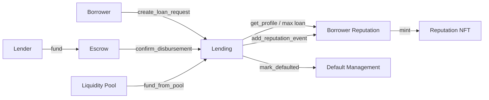

<h1 align="center">Kredex Contracts</h1>

<p align="center"><em>Soroban smart contracts powering on-chain reputation, escrow and P2P lending on Stellar.</em></p>

<p align="center">
  <a href="https://github.com/kredex-org/contracts/actions/workflows/ci.yml"></a>
  
  
  
  
</p>

<p align="center">
  <a href="https://kredex.vercel.app">Live App</a> ·
  <a href="https://kredex-docs.vercel.app">Docs</a> ·
  <a href="https://github.com/kredex-org/product">Product repo</a> ·
  <a href="https://github.com/orgs/kredex-org/discussions">Discussions</a> ·
  <a href="https://x.com/kredexweb3">X</a>
</p>

---

## About

This repository contains the [Soroban](https://soroban.stellar.org) smart contracts behind [Kredex](https://kredex.vercel.app), a peer-to-peer lending platform that replaces collateral with **on-chain reputation**. The contracts are **live on Stellar Testnet**, used by the [product](https://github.com/kredex-org/product) web app.

> ⚠️ **Status:** Testnet only. The contracts have **not** been independently audited. Do not use them with real funds.

## Contracts

| Contract | Crate | Purpose |
| :-- | :-- | :-- |
| Borrower Reputation | [`borrower_reputation`](borrower_reputation) | Credit score, tiers, KYC tier, max loan and interest-rate calculation, freezing |
| Reputation NFT | [`reputation_nft`](reputation_nft) | Soulbound (non-transferable) badges for high-reputation borrowers |
| Lending | [`lending`](lending) | Loan requests, approvals, activation, repayment and default marking |
| Escrow | [`escrow`](escrow) | Holds lender funds with a revocation window until disbursement |
| Default Management | [`default_management`](default_management) | Default records and the insurance fund |
| Liquidity Pool | [`liquidity_pool`](liquidity_pool) | Pooled deposits, allocation to loans, repayments |
| Oracle Adapter | [`oracle_adapter`](oracle_adapter) | Price feeds for health checks |

Full function reference, deployed Testnet IDs and design notes: **[docs/CONTRACTS.md](docs/CONTRACTS.md)**.



## Quick start

### Prerequisites

| Tool | Version | Install |
| :-- | :-- | :-- |
| Rust | stable | [rustup.rs](https://rustup.rs) |
| WASM target | - | `rustup target add wasm32-unknown-unknown` |
| Stellar CLI | latest | [Setup guide](https://developers.stellar.org/docs/build/smart-contracts/getting-started/setup) |

### Build and test

```bash
git clone https://github.com/kredex-org/contracts.git
cd contracts

# Run the whole workspace's tests
cargo test

# Build optimized WASM for every contract
cargo build --target wasm32-unknown-unknown --release
# Output: target/wasm32-unknown-unknown/release/*.wasm
```

Work on a single contract:

```bash
cargo test -p borrower-reputation
```

### Deploy to Testnet (optional)

```bash
stellar keys generate my-admin --network testnet --fund
# See scripts/deploy.sh (macOS/Linux) or scripts/deploy.ps1 (Windows)
```

> Read the script before running it. Deployments use **your own** keys and cost nothing on Testnet. **Never commit keys or `.env` files.**

## Project layout

```text
contracts/
├─ borrower_reputation/   # score, tiers, KYC, profiles (has tests)
├─ reputation_nft/        # soulbound badges
├─ lending/               # loan lifecycle + interest_rate.rs
├─ escrow/                # holds & revocation window
├─ default_management/    # defaults + insurance fund
├─ liquidity_pool/        # LP deposits & allocation
├─ oracle_adapter/        # price feeds
├─ scripts/               # deploy.sh / deploy.ps1
├─ docs/                  # contract reference
├─ Cargo.toml             # workspace (soroban-sdk 22)
└─ Cargo.lock
```

## Contributing

We'd love your help, and **tests are the best way in**. Only `borrower_reputation` has a test suite so far, so every other contract has room for a valuable first contribution.

| Level | Ideas |
| :-- | :-- |
| 🌱 Beginner | Add doc comments to public functions, fix typos, improve this README, run tests on your OS and report issues |
| 🔧 Intermediate | Write unit tests for `escrow`, `lending`, `liquidity_pool`, `oracle_adapter`; add clippy fixes |
| 🦀 Advanced | Property/fuzz tests, review authorization and arithmetic, reduce WASM size, propose upgrade patterns |

Start with **[CONTRIBUTING.md](CONTRIBUTING.md)**, then look for [`good first issue`](https://github.com/kredex-org/contracts/labels/good%20first%20issue). Not sure where to start? Ask in [Discussions](https://github.com/orgs/kredex-org/discussions).

## Security

Found a vulnerability? **Don't open a public issue.** Use [private vulnerability reporting](https://github.com/kredex-org/contracts/security/advisories/new). See the [Security Policy](https://github.com/kredex-org/.github/blob/main/SECURITY.md).

## Community

- 💬 [Discussions](https://github.com/orgs/kredex-org/discussions)
- 🐦 [@kredexweb3](https://x.com/kredexweb3)
- 📜 [Code of Conduct](https://github.com/kredex-org/.github/blob/main/CODE_OF_CONDUCT.md)

## License

[MIT](LICENSE) © Kredex Org
